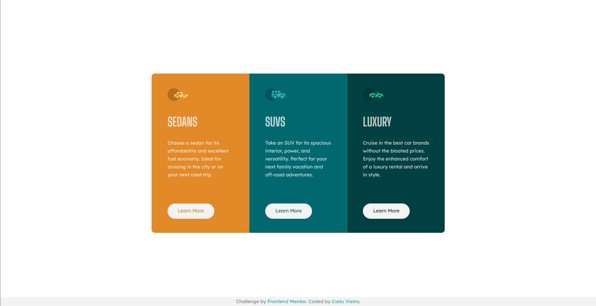

# Frontend Mentor - 3-column preview card component solution

This is a solution to the [3-column preview card component challenge on Frontend Mentor](https://www.frontendmentor.io/challenges/3column-preview-card-component-pH92eAR2-). Frontend Mentor challenges help you improve your coding skills by building realistic projects. 

## Table of contents

- [Overview](#overview)
  - [The challenge](#the-challenge)
  - [Screenshot](#screenshot)
  - [Links](#links)
- [My process](#my-process)
  - [Built with](#built-with)
  - [What I learned](#what-i-learned)
  - [Useful resources](#useful-resources)
- [Author](#author)
- [Acknowledgments](#acknowledgments)

## Overview

### The challenge

Users should be able to:

- View the optimal layout depending on their device's screen size
- See hover states for interactive elements

### Screenshot




### Links

- [Solution URL](https://www.frontendmentor.io/solutions/solution-for-3-column-preview-card-component-cygEQ4yR1l)
- [Live site URL](https://frontend-mentor-3-column-preview-card-component-tau.vercel.app/)

## My process

### Built with

- HTML5 
- CSS3

### What I learned

Creating a hover state that scales up when the mouse goes over the button.
```css
.box button:hover {
    transform: scale(1.05);
    cursor: pointer;
    filter: brightness(115%);
    
}
```

### Useful resources

- [Tailwind Reset CSS](https://tailwindcss.com/) - This helped me to reset all the pre-configured browser CSS settings. Obtained through the Tailwind's CSS output.
- [PowerToys](https://learn.microsoft.com/pt-br/windows/powertoys/) - PowerToys was very useful for measuring all the elements of the original design provided by Frontend Mentor. I used the ScreenRuler tool.

## Author

- Frontend Mentor - [@caduovieira](https://www.frontendmentor.io/profile/caduovieira)
- LinkedIn - [@carloseduardovieira](https://www.linkedin.com/in/carlos-eduardo-vieira-37b991154/)

## Acknowledgments

A huge thanks to [@bernardrodrigues](https://www.github.com/bernard-rodrigues) for helping me out with this project! 
